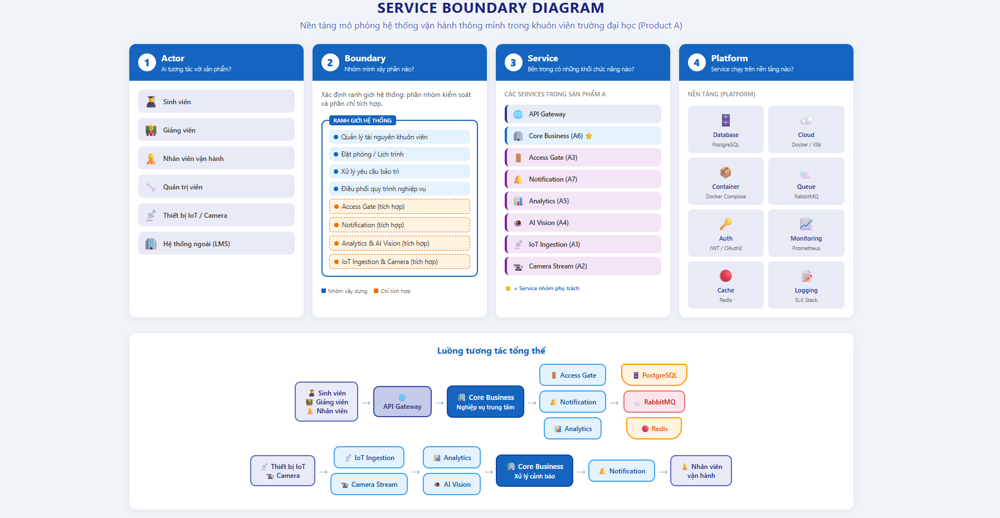

# Service Boundary của nhóm

## 1. Thông tin nhóm

- Tên nhóm: Nhóm 6
- Lớp: CNTT 17-08
- Thành viên: Nguyễn Xuân Giang, Đỗ Văn Tuyên
- Service nhóm phụ trách: **Core Business** – Dịch vụ xử lý nghiệp vụ trung tâm
- Sản phẩm tổng thể của lớp: Nền tảng mô phỏng hệ thống vận hành thông minh trong khuôn viên trường đại học (Product A)

## 2. Actor

Các tác nhân tương tác với hệ thống/service:

| Actor | Mô tả |
|---|---|
| **Sinh viên** | Sử dụng ứng dụng để đặt phòng học, tra cứu lịch trình, nhận thông báo, báo cáo sự cố trong khuôn viên |
| **Giảng viên** | Quản lý lịch giảng dạy, yêu cầu tài nguyên phòng học, thiết bị |
| **Nhân viên vận hành** | Giám sát trạng thái cơ sở vật chất, xử lý yêu cầu bảo trì, quản lý năng lượng |
| **Quản trị viên hệ thống** | Cấu hình hệ thống, quản lý người dùng, phân quyền, theo dõi dashboard |
| **Thiết bị IoT** | Cảm biến nhiệt độ, độ ẩm, camera, hệ thống chiếu sáng, điều hòa gửi dữ liệu telemetry |
| **Hệ thống ngoại** | Hệ thống quản lý đào tạo (LMS), hệ thống ERP trường, hệ thống email/SMS |

## 3. System Boundary

Nhóm xây dựng **Core Business** – dịch vụ xử lý nghiệp vụ trung tâm, đóng vai trò điều phối và xử lý logic nghiệp vụ chính của toàn bộ nền tảng Product A.

**Phần nhóm kiểm soát (xây dựng trực tiếp):**

- Quản lý tài nguyên khuôn viên (phòng học, thiết bị, khu vực)
- Đặt phòng / đặt lịch sử dụng tài nguyên
- Xử lý yêu cầu bảo trì và sự cố cơ sở vật chất
- Quản lý lịch vận hành (lịch mở cửa tòa nhà, lịch bảo trì định kỳ)
- Điều phối quy trình nghiệp vụ giữa các service khác
- Quản lý cấu hình vận hành (ngưỡng cảnh báo, chính sách tự động hóa)

**Phần nhóm chỉ tích hợp (sử dụng từ service khác):**

- Xác thực, kiểm soát ra vào (từ Access Gate)
- Gửi thông báo đến người dùng (từ Notification)
- Thu thập & phân tích dữ liệu IoT, camera (từ IoT Ingestion, Analytics, Camera Stream, AI Vision)
- Lưu trữ dữ liệu (Database / Storage Platform)
- Giám sát & logging (Monitoring Platform)

## 4. Service Boundary

**Service của nhóm CÓ trách nhiệm:**

- Xử lý logic nghiệp vụ cốt lõi: đặt phòng, quản lý tài nguyên, xử lý yêu cầu bảo trì
- Điều phối workflow giữa các service (ví dụ: khi cảm biến phát hiện bất thường → tạo yêu cầu bảo trì → gửi thông báo)
- Quản lý trạng thái và vòng đời của các thực thể nghiệp vụ (phòng, thiết bị, yêu cầu)
- Cung cấp API cho các service khác và API Gateway để phục vụ frontend
- Đảm bảo tính nhất quán dữ liệu nghiệp vụ (data consistency)
- Áp dụng business rules và validation

**Service KHÔNG làm:**

- Không xử lý kiểm soát ra/vào trực tiếp (thuộc Access Gate)
- Không gửi trực tiếp email / push notification (thuộc Notification)
- Không thu thập hoặc xử lý dữ liệu thô từ IoT/Camera (thuộc IoT Ingestion / Camera Stream / Analytics)
- Không render giao diện người dùng (thuộc Frontend)
- Không quản lý hạ tầng container / cloud (thuộc Platform team)

## 5. Input / Output

### Input

- Yêu cầu đặt phòng học / phòng họp từ sinh viên, giảng viên (qua API Gateway)
- Yêu cầu bảo trì, báo cáo sự cố từ nhân viên vận hành
- Sự kiện cảnh báo từ Analytics / AI Vision (nhiệt độ vượt ngưỡng, bất thường)
- Thông tin người dùng đã xác thực từ Access Gate / Auth Provider
- Dữ liệu cấu hình vận hành từ quản trị viên

### Output

- Xác nhận / từ chối yêu cầu đặt phòng (kèm lý do)
- Phiếu bảo trì được tạo, cập nhật trạng thái (mới → đang xử lý → hoàn thành)
- Sự kiện nghiệp vụ phát ra message queue (để Notification gửi thông báo)
- Dữ liệu trạng thái tài nguyên real-time cho Dashboard
- Báo cáo tổng hợp vận hành (thống kê đặt phòng, bảo trì, sử dụng tài nguyên)

## 6. API dự kiến

| Method | Endpoint | Mục đích |
|---|---|---|
| GET | `/health` | Kiểm tra trạng thái service |
| GET | `/api/rooms` | Lấy danh sách phòng học / tài nguyên |
| GET | `/api/rooms/{id}` | Lấy chi tiết một phòng |
| POST | `/api/rooms` | Tạo mới phòng / tài nguyên |
| PUT | `/api/rooms/{id}` | Cập nhật thông tin phòng |
| POST | `/api/bookings` | Đặt phòng |
| GET | `/api/bookings?userId={id}` | Lấy danh sách đặt phòng của người dùng |
| PUT | `/api/bookings/{id}/cancel` | Hủy đặt phòng |
| POST | `/api/maintenance-requests` | Tạo yêu cầu bảo trì |
| GET | `/api/maintenance-requests` | Lấy danh sách yêu cầu bảo trì |
| PUT | `/api/maintenance-requests/{id}/status` | Cập nhật trạng thái yêu cầu bảo trì |
| GET | `/api/operations/schedule` | Lấy lịch vận hành |
| GET | `/api/dashboard/summary` | Lấy dữ liệu tổng hợp cho dashboard |
| POST | `/api/alerts/process` | Xử lý cảnh báo từ hệ thống IoT/Analytics |

## 7. Phụ thuộc service khác

**Service này gọi đến service nào?**

| Service | Mục đích gọi |
|---|---|
| **Access Gate** | Xác thực thông tin người dùng, kiểm soát ra/vào |
| **Notification** | Gửi yêu cầu thông báo (đặt phòng thành công, cảnh báo bảo trì) |
| **Analytics** | Truy vấn dữ liệu phân tích, báo cáo hệ thống |

**Service nào gọi đến service này?**

| Service | Mục đích gọi |
|---|---|
| **API Gateway** | Chuyển tiếp request từ frontend đến Core Business |
| **Analytics / AI Vision** | Gửi cảnh báo khi phát hiện bất thường từ dữ liệu IoT/Camera |
| **Access Gate** | Kiểm tra trạng thái tài nguyên/phòng khi cấp quyền ra/vào |

## 8. Sơ đồ minh họa

